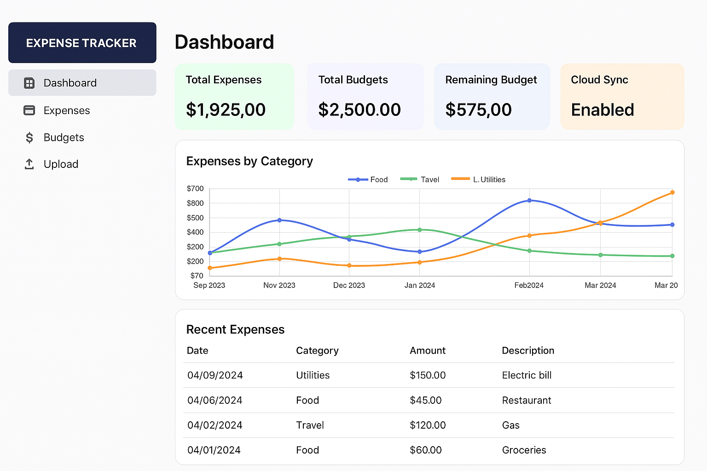

# 💰 Expense Tracker Cloud App

A full-stack cloud-based expense tracker built with **Spring Boot**, **React**, **AWS**, and **Docker**. This project allows users to manage expenses with real-time insights, PDF export, and cloud integration for receipts.



---

## 🚀 Features

- Spring Boot backend with REST APIs and JWT Auth
- React frontend with dynamic expense charts
- AWS Lambda for PDF report generation
- S3 + DynamoDB for cloud receipt storage
- Dockerized backend for deployment

---

## 🧰 Tech Stack

- **Backend:** Java (Spring Boot), JWT, AWS Lambda
- **Frontend:** React, Chart.js
- **Cloud:** AWS S3, DynamoDB, Docker
- **Database:** PostgreSQL (local) or DynamoDB (cloud)

---

## 📸 Screenshots

<p align="center">
  
</p>

---

## 📦 Getting Started

```bash
cd backend
./mvnw spring-boot:run

cd frontend
npm install
npm start
